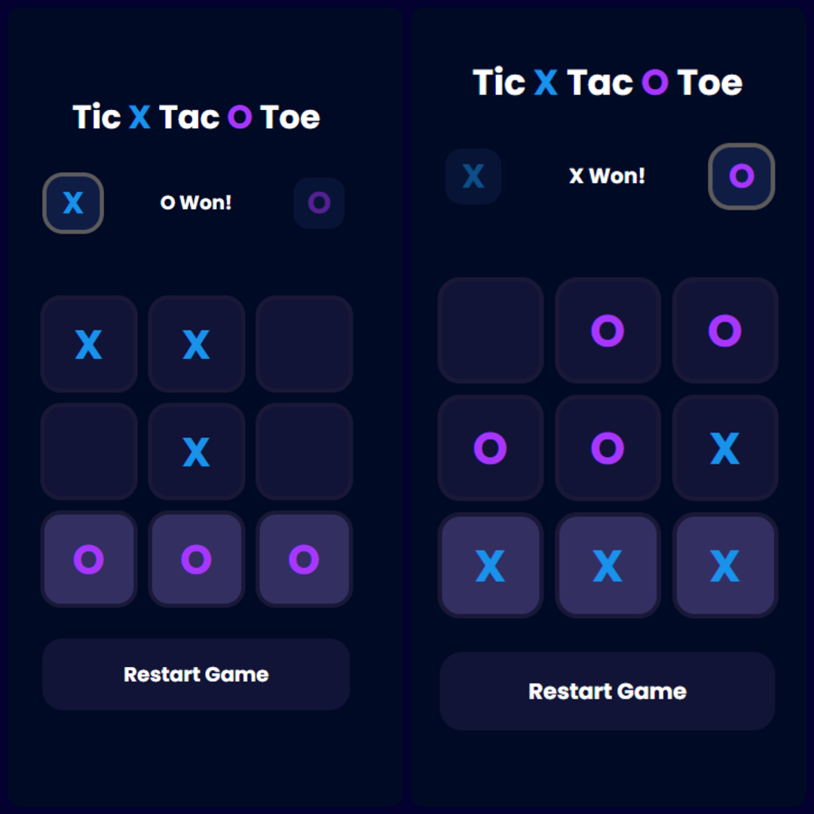
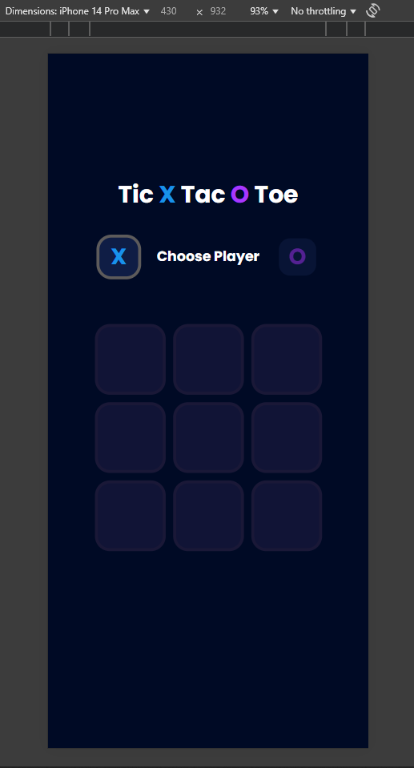
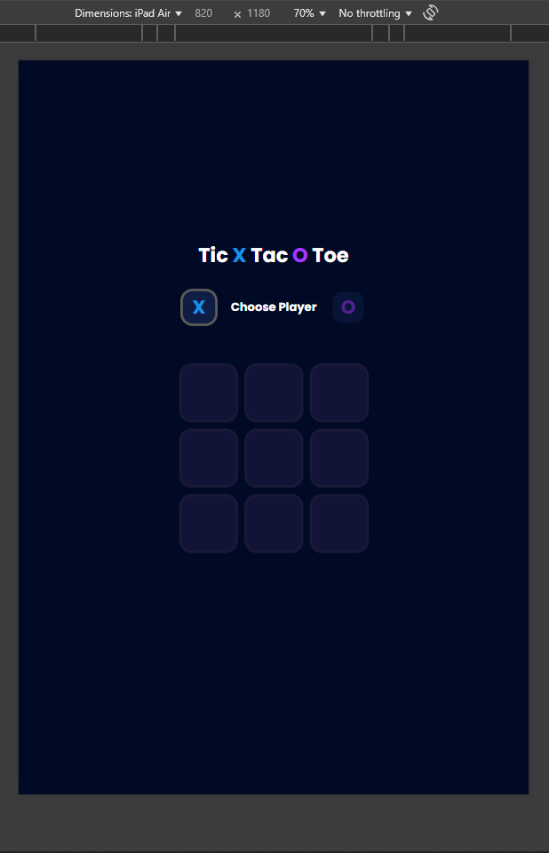

# 🎮 Tic X Tac O Toe – Web Game

An interactive **Tic Tac Toe** game built with HTML, CSS, and JavaScript. Choose your symbol (**X or O**), play against the computer, and enjoy a fully responsive UI on all devices.



---

## Live Demo

[Click Here to See Live Demo!](https://deeps1970.github.io/ApexPlanet-Task2-Internship/)

---

## 🚀 Features

- ✅ Player vs Computer AI
- ✅ Select X or O before game starts
- ✅ Computer auto-plays as the opposite symbol
- ✅ Prevents switching symbols mid-game
- ✅ Win detection & draw handling
- ✅ Restart button after game ends
- ✅ Fully responsive (mobile, tablet, desktop)

---

## 🧠 Tech Stack

- **HTML5**
- **CSS3**
- **JavaScript**

---

## 📸 Preview

| Desktop View | Mobile View | Tablet View |
|--------------|-------------|-------------|
|  |  |  |

---

## 🔧 Run Locally

```bash
git clone https://github.com/your-username/tic-tac-toe.git
cd tic-tac-toe
Open index.html in your browser.
Or use Live Server in VS Code.
```

---

## 🕹️ How to Play
- Select X or O to begin.
- Take turns with the computer to fill the 3x3 grid.
- Get 3 in a row (horizontally, vertically, or diagonally) to win.
- Click Restart once the game ends.

---

## 📬 Credits & Connect
Made with ❤️ by [Deepak](https://www.linkedin.com/in/deepak1970/)
Feel free to ⭐ the repo or contribute!

---
